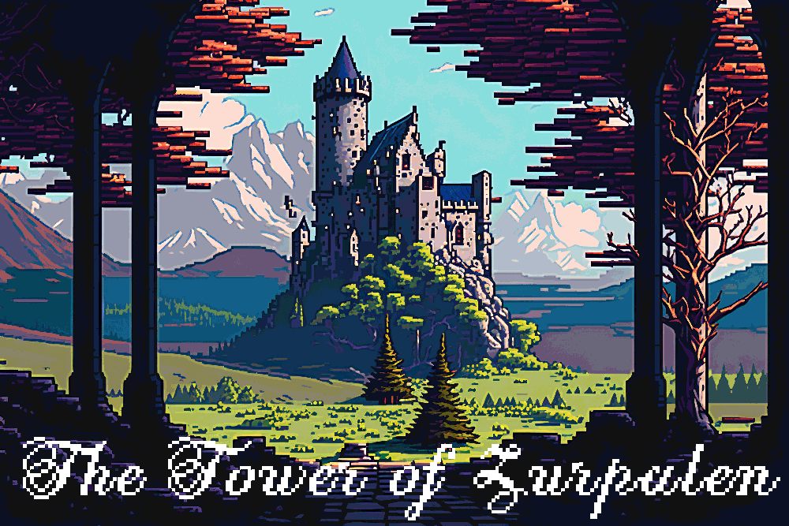
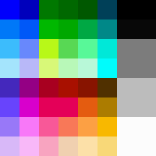

# Tower of Zurpalen
## Capstone project with FullStack Academy
### Jan-Feb 2024

Inspired by 8-Bit RPG adventures like the original Nintendo Enternainment System's Legend of Zelda along with turn-by-turn combat, we are introducing a game called...

## Play online
*the server takes a minute to spin up:*
https://tower-of-zurpelan.onrender.com/

## Developed by
- Salvador Carrazco
- Nick Golebiewski
- Joel Pickler 
- Taggart Salcedo

## Story
### The Tower of Zarpulen
*The princess has been captured by the evil wizard Zurpalen. The kingdom is in disarray.*

*Choose to be a warrior, a mage, or a rogue, each with their own unique strengths and weaknesses, in your quest to save the princess from the wizard’s tower, before chaos reigns eternal.*

*Can you make your way up through each floor of the tower to face Zurpalen?*

*The journey will be difficult, heroes have entered, but none have returned...* 

## Technologies
- Phaser.io => 2D javascript game framework
- React => JS Web Framework
- Redux => State management tool for React
- Prisma => Database ORM
- Express => Sever
- Vite => Build Tool
- ViteExpress => Combined the two above
- Axios => Makes API calls with less code
- JWT => Issues login tokens
- BCrypt => Encrypts sensitve passwords
- Tiled => Make game maps

## Play on your machine

1. Git Clone this repo
2. make a PostgresQL database on your machine. In terminal type: createDB TOZ
3. npm install in your new repo
4. create a .env file in the top level of the repo with...
  - JWT_SECRET:"zurpalen"
  - DATABASE_URL="postgresql://YOUR USERNAME:YOUR USERNAME@localhost:5432/toz_db?schema=public"

## Useful links on this journey
How do you start drawing pixel art? (*So useful on setting up Photoshop!*)
https://www.adobe.com/creativecloud/design/discover/pixel-art.html

Combine spritesheets into an atlas. Exports a png and a json file.
https://www.leshylabs.com/apps/sstool/

Getting started with Phaser
https://phaser.io/tutorials/getting-started-phaser3/index

Opensource tilesets (i.e. how you build the levels that the character sprites interact on)
https://opengameart.org/

## Design Sensibility

- When making custom graphics, use the 52-color original NES (Nintendo Entertainment System) pallete.
- Turn "Pixel mode" on, so the edges don't get blurred, and we have crisp pixels for that 1980s (and 1990s) look.
- Let Phaser do the animations!

## Thanks from us to you

